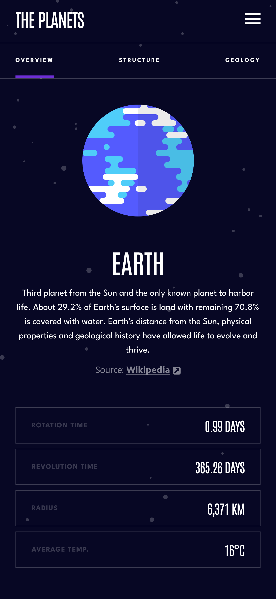
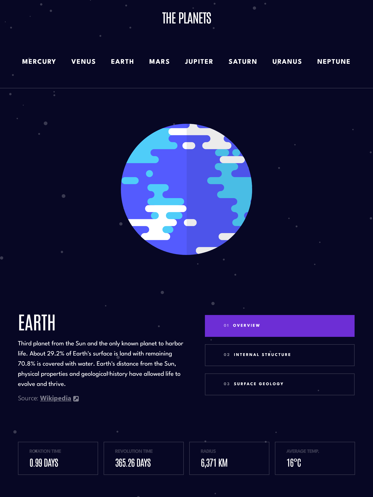
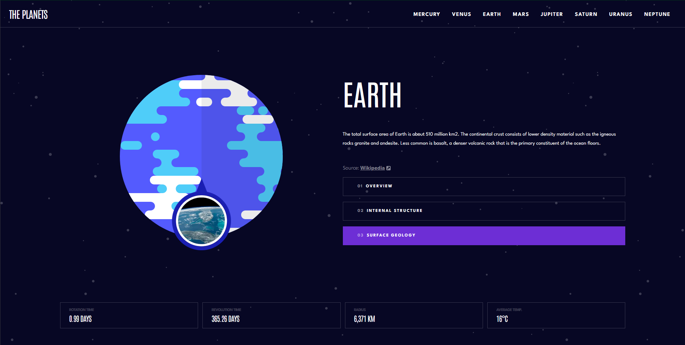

# Frontend Mentor - Planets fact site solution

This is a solution to the [Planets fact site challenge on Frontend Mentor](https://www.frontendmentor.io/challenges/planets-fact-site-gazqN8w_f). Frontend Mentor challenges help you improve your coding skills by building realistic projects. 

## Table of contents

- [Overview](#overview)
  - [The challenge](#the-challenge)
  - [Screenshot](#screenshot)
  - [Links](#links)
- [My process](#my-process)
  - [Built with](#built-with)
  - [What I learned](#what-i-learned)
  - [Continued development](#continued-development)
  - [Useful resources](#useful-resources)
- [Author](#author)

## Overview

### The challenge

Users should be able to:

- View the optimal layout for the app depending on their device's screen size
- See hover states for all interactive elements on the page
- View each planet page and toggle between "Overview", "Internal Structure", and "Surface Geology"

### Screenshot

<p style="display: grid; grid-template-columns: 200px 400px; grid-gap: 10px">
  
  
  
</p>

### Links

- Solution URL: [Frontend Mentor](https://www.frontendmentor.io/solutions/responsive-planet-facts-website-sc5XsIcZ0D)
- Live Site URL: [Vercel](https://planets-fact-site-beta.vercel.app/)

## My process

### Built with

- Semantic HTML5 markup
- CSS custom properties
- Flexbox
- CSS Grid
- Mobile-first workflow
- [React](https://reactjs.org/) - JS library
- [Next.js](https://nextjs.org/) - React framework
- [TailwindCSS](tailwindcss.com/) - Tailwind CSS Library

### What I learned

As I continue improving in Mobile-first workflow, this project had some serious challenges. One of the coolest things I had to learn in order to finish this project was how to create a side navigation bar. I think it turned out very good and I even added a little sliding animation.

By switching from a width of 0 to full using javascript, we can make a really cool sliding menu.

```jsx
<div className={`flex ${showMenu ? 'w-full px-6' : 'w-0'} mt-[4.7rem] transition-[width] overflow-x-hidden ease-linear duration-200 fixed ...`}>
  ...
</div>
```

### Continued development

There is not much functionality to add to this project (unless they reinstate Pluto's planet status or a new planet is discovered!) but it could use some polishing, maybe add some animations as you change sections or maybe add a preloading animation to the images.

**Note: Delete this note and the content within this section and replace with your own plans for continued development.**

### Useful resources

- [How To Create a Side Navigation Menu](https://www.w3schools.com/howto/howto_js_sidenav.asp) - This helped me for XYZ reason. I really liked this pattern and will use it going forward.
- [Dynamic Classes in Tailwind CSS](https://www.codeconcisely.com/posts/tailwind-css-dynamic-class/) - This is an amazing article which helped me finally understand XYZ. I'd recommend it to anyone still learning this concept.

**Note: Delete this note and replace the list above with resources that helped you during the challenge. These could come in handy for anyone viewing your solution or for yourself when you look back on this project in the future.**

## Author

- Website - [TBD]
- Frontend Mentor - [@marxguimaraes](https://www.frontendmentor.io/profile/marxguimaraes)
